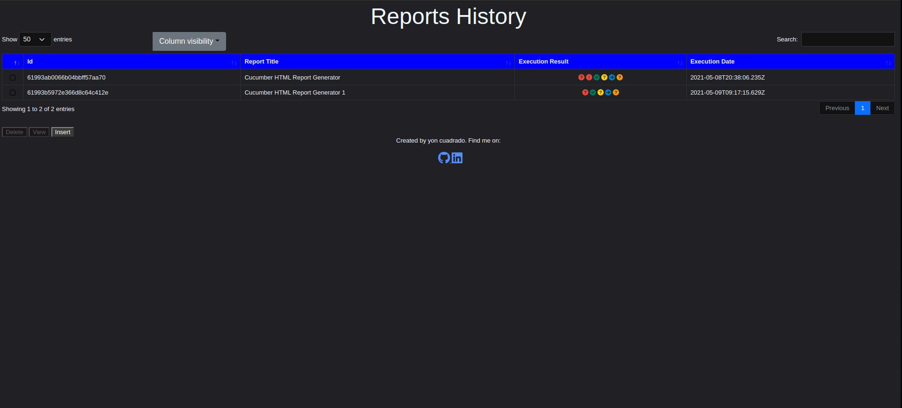
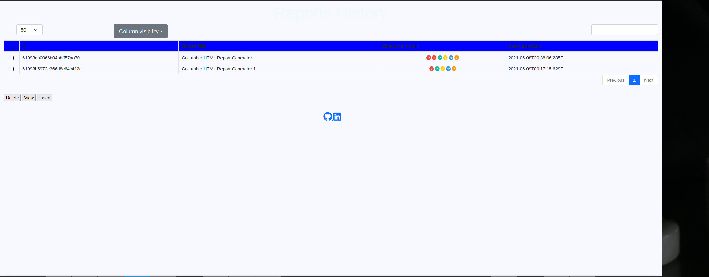

cucumber-html-reports-server
===============================
[](http://opensource.org/licenses/MIT)

[](https://nodei.co/npm/cucumber-html-reports-server/)

This project provides a web interface where you can manage the reports added with the npm package [cucumber-html-report-generator](https://nodei.co/npm/cucumber-html-report-generator/).




## Install
Install this module globally with the following command:

``` bash
npm install -g cucumber-html-reports-server
```


[Install mongodb in your computer ](https://docs.mongodb.com/manual/installation/)

## Start

To start the server is only necessary to execute an script. This script receives an optional parameter that is the configuration file.

``` bash
startServer configuration-file.json
```

### configuration-file.json
The default configuration file is the file src/scripts/configuration/serverConfiguration.json and it is used if none is provided. It contains a set of minimal properties that are needed to start the server. Below is the list of all the possible properties that can be used.

```typescript
  reportDisplay: {
      showExecutionTime?: boolean;
      navigateToFeatureIfThereIsOnlyOne?: boolean;
      openReportInBrowser?: boolean;
      customStyle?: string;
      overrideStyle?: string;
      reportPath?: string;
      theme?: string;
      useCDN?: boolean;
  }
  mongoDb: {
      mongoDbOptions?: mongoose.ConnectOptions;
      dbName: string;
      dbHost: string;
      dbPort: number;
      collections?: {
        reports?: string;
        features?: string;
        scenarios?: string;
        steps?: string;
        outputs?: string;
      };
  }
  serverDisplay: {
      port: number;
      theme?: string;
      useCDN?: boolean;
  }
}
```

## Description of the options in the configuration file
 ### reportDisplay

 These parameters define how the report is going to be displayed when a report of the server is opened.

#### `showExecutionTime`
- **Type:** `Boolean`
- **Mandatory:** No
- **DefaultValue:** False

It controls if the execution time is displayed in the report.

#### `navigateToFeatureIfThereIsOnlyOne`
- **Type:** `Boolean`
- **Mandatory:** No
- **DefaultValue:** False

If there is only one feature in the report and this parameter is enabled then the feature detail is opened by default when the option openReportInBrowser is active.

#### `openReportInBrowser`
- **Type:** `Boolean`
- **Mandatory:** No
- **DefaultValue:** False

It allows to open automatically the report when it is viewed if it is false the report is only generated.

#### `customStyle`
- **Type:** `String`
- **Mandatory:** No
- **DefaultValue:** undefined

With this parameter it is possible to provide an alternative css file to the report generated. This css file will be used instead of the original file.

#### `overrideStyle`
- **Type:** `String`
- **Mandatory:** No
- **DefaultValue:** undefined

This parameter accepts a css file that is joined with the original css file of the report.

#### `reportPath`
- **Type:** `string`
- **Mandatory:** No
- **DefaultValue:** undefined

With this parameter is possible to define the folder where the report obtained from the server is going to be generated. If this parameter is not provided the report is generated in the subfolder cucumber-html-report-generator at the temp folder with the current date and time.

#### `theme`
- **Type:** `String`
- **Mandatory:** No
- **DefaultValue:** undefined

The theme parameter allows to define the theme of the server. There are two options 'dark', for dark theme and 'light', for a light theme

#### `useCDN`
- **Type:** `Boolean`
- **Mandatory:** No
- **DefaultValue:** False

With this parameter you can decide if the resources used to display the html will be local resources or obtained from a cdn.

### - mongoDb

#### `mongoDbOptions`
- **Type:** `Boolean`
- **Mandatory:** No
- **DefaultValue:** undefined

This parameter has the ConnectOptions of mongoose.

#### `showExecutionTime`
- **Type:** `Boolean`
- **Mandatory:** No
- **DefaultValue:** False

#### `dbName`
- **Type:** `String`
- **Mandatory:** Yes

This is the name of the database that will be created by mongoose

#### `dbHost`
- **Type:** `String`
- **Mandatory:** Yes

It has the host part of the url that is used to connect to the mongoose database.

#### `dbPort`
- **Type:** `String`
- **Mandatory:** Yes

It has the port part of the url that is used to connect to the mongoose database.

#### `collections.reports`
- **Type:** `String`
- **Mandatory:** No
- **DefaultValue:** Reports

This parameter value has the name of the Reports collection.

#### `collections.outputs`
- **Type:** `String`
- **Mandatory:** No
- **DefaultValue:** Outputs

This parameter value has the name of the Outputs collection.

#### `collections.reports`
- **Type:** `String`
- **Mandatory:** No
- **DefaultValue:** Reports

This parameter value has the name of the Reports collection.

#### `collections.scenarios`
- **Type:** `String`
- **Mandatory:** No
- **DefaultValue:** Scenarios

This parameter value has the name of the Scenarios collection.

#### `collections.scenarios`
- **Type:** `String`
- **Mandatory:** No
- **DefaultValue:** Steps

This parameter value has the name of the Steps collection.

### serverDisplay

#### `port`
- **Type:** `number`
- **Mandatory:** Yes

It has the port that will be used to start the server.

#### `theme`
- **Type:** `String`
- **Mandatory:** No
- **DefaultValue:** Dark

This parameter defines the theme that is going to be used by the server. There are two options: Dark and Light.

#### `useCDN`
- **Type:** `Boolean`
- **Mandatory:** No
- **DefaultValue:** False

With this parameter is controlled if the server is going to use local resources to render the html or if the reources will be from a cdn.

## Server functionalities



### View existing reports
Click on the checkbox at the begining of one or multiple rows and click on the view button. After that the reports html will be gnerated as it is defined in the configuration options.

### Insert a new report
Click on the insert button and select an existing report that you want to insert into the database. After that the report will be inserted into the database and it will appear in the list.
### Delete an existing report
Click on the checkbox at the begining of one or multiple rows and click on the delete button. After that the reports will be deleted.

## Changelog and Releases
The Changelog and releases can be found [here](https://github.com/yon-cuadrado-projects/cucumber-reports-server/releases)

## Contributing
How to contribute can be found [here](./docs/CONTRIBUTING.md)
